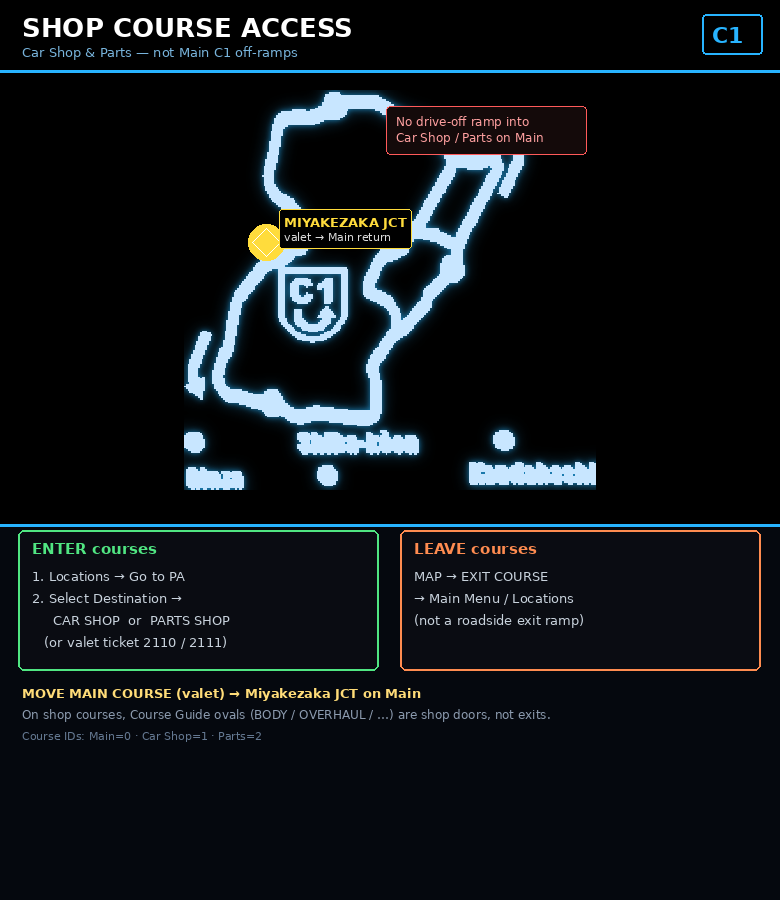
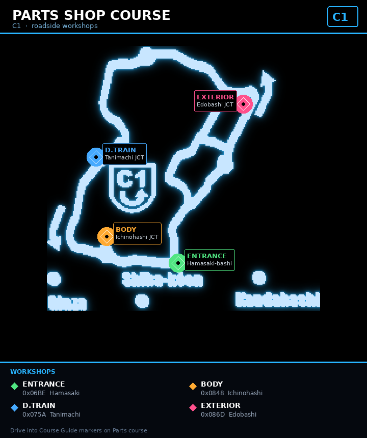
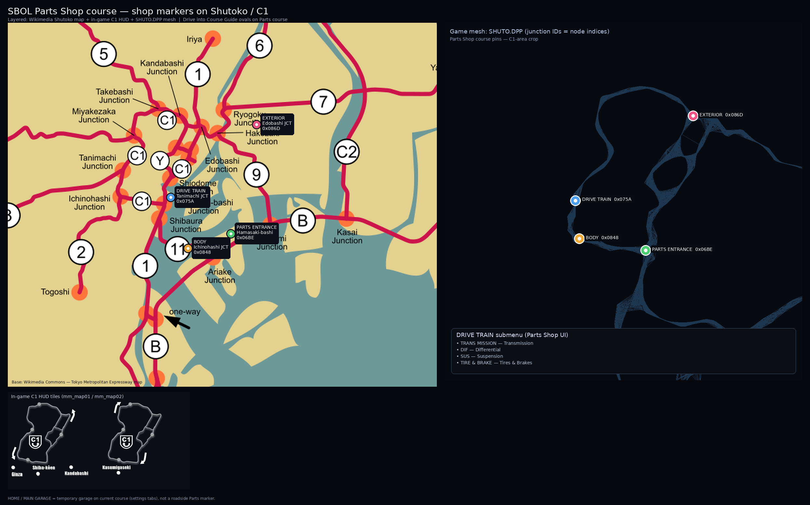

# SBOL player field guide

Consolidated notes from live play on the private server (client ~v2.03, handle examples like `janko_admin`).  
Use this as the main operator / player reference. Maps live in this folder.

---

## 1. Controls & in-course HUD

### Bottom tabs (while driving)

| Tab | Role |
|-----|------|
| **MAP** | Road Map Normal/Wide, Course Guide, **EXIT COURSE** (leave to Locations / main menu) |
| **NAVI** | Mini-map options |
| **ASSIST** | Shift Assist on/off |
| **ITEM** | Inventory (valet tickets, Omamori, etc.) |
| **DATA** | Personal / team data |
| **HOME** | Temporary garage on the **current** course (`DRIVE` / settings; Back returns to course) |

There is **no Esc options menu** while driving. `GAME_QUIT` (even if bound to Escape) is **quit game**, not settings and not “Go to PA”.

| Action | Default |
|--------|---------|
| OK / confirm | **Enter** |
| Cancel / Back | **Backspace** (`KB_BACK`), not Escape |
| Challenge NPC / player | **PASSING** (default **`C`**) — headlights alone do nothing |

### Course Guide (bottom center)

Junction overlays show **real destination splits**, not flavor text only.

Example on **Main** at **Tatsumi JCT**:

- Left: **TIME ATTACK A** / 湾岸線 (Wangan)
- Right: 湾岸線 (Wangan)

Follow the labeled branch to transfer.  
`B` / MAP → Road Map toggles **[NORMAL MAP]** vs **[WIDE MAP]**.

### Debug / status strip (left)

When visible:

| Field | Meaning |
|-------|---------|
| **POSITION** | `junction:distance:extra` as hex (e.g. `075A:01C7:07F3`) |
| **COURSE NAME** | `Main`, `Car Shop`, `Parts`, … |
| **CURRENT TRACK** | BGM title (Vorbis `TITLE`, e.g. `Metropolis As`) |
| **LV** / **CP** | Level / currency |
| **PERSONS IN COURSE** / **NETWORK** | Lobby occupancy / net |

Junction ID in `POSITION` ≈ node index in `game_client/data/COURSE/SHUTO.DPP`.

---

## 2. Courses (IDs)

| ID | Name | Notes |
|----|------|--------|
| `0` | **Main** | Default after beginner; rivals spawn here |
| `1` | **Car Shop** | Buy/sell cars, OVERHAUL, tickets |
| `2` | **Parts** | Aero / drive train / body workshops |
| `3`–`4` | Freeway A/B | |
| `5` | Survival | |
| `6`–`7` | **Time Attack A/B** | e.g. Tatsumi → TIME ATTACK A |

Server names: `coursenames[]` in Battle Server (`Main`, `Car Shop`, `Parts`, …).

---

## 3. PA hub & shop course access

Car Shop / Parts are **separate courses**, **not** Main C1 off-ramps (unlike Tatsumi → Time Attack).

### Enter

| Destination | How |
|-------------|-----|
| **Car Shop** | Locations → Go to PA → **Select Destination → CAR SHOP**, or valet **MOVE CAR SHOP COURSE** (item `2110`) |
| **Parts Shop** | Same → **PARTS SHOP**, or valet **MOVE PARTS SHOP COURSE** (`2111`) |

PA labels also include: **MERCHANDISE SHOP**, **TUNED CAR EXCHANGE**, **Return to PA**, **Go to Shops**.

### Leave

| Action | How |
|--------|-----|
| Leave shop course | **MAP → EXIT COURSE** → Main Menu / Locations (**menu**, not a roadside ramp) |
| Valet back to Main | **MOVE MAIN COURSE** → lands at **Miyakezaka JCT** (三宅坂) |

Period reference: [4Gamer 2004-07-07](https://www.4gamer.net/games/007/G000798/20040707211303/) — valet tickets to Main (三宅坂), Car Shop, Parts Shop.

---

## 4. Car Shop course

Roadside / Course Guide services on **Car Shop** (not Parts):

| Marker / UI | What it does |
|-------------|--------------|
| **OVERHAUL** | Engine refresh / overhaul (CP). Found during live play on the Car Shop loop |
| Dealer buildings | Buy / sell cars, tickets |

Do **not** expect Parts workshops (BODY / DRIVE TRAIN / …) on this course — those are on **Parts**.

Chat helpers used in testing: `!give item 2110` / `2111` for valet tickets (ITEM BOX → use). Safer than raw SQL `item_data` edits.

---

## 5. Parts Shop course (live pins)

Workshops are **separate Course Guide ovals**. Drive into the label to open that shop.

| Shop | Junction | Landmark / live POSITION |
|------|----------|---------------------------|
| Course entrance (green wrench / “power-up”) | `0x06BE` | Near 浜崎橋; badge **PARTS SHOP COURSE**; `06BE:…:0203` |
| **BODY** | `0x0848` | **Ichinohashi JCT** (一ノ橋); `0848:012A:0099`; left → Meguro / 目黒線, right → C1 Outer |
| **DRIVE TRAIN** | `0x075A` | **Tanimachi JCT** (谷町); `075A:01C7:07F3`; left → Shibuya / 渋谷線, right → C1 Outer |
| **EXTERIOR** | `0x086D` | **Edobashi JCT** (江戸橋); `086D:01D4:08F3`; left → Mukojima / 向島線, right → C1 Outer |

### DRIVE TRAIN submenu

Opens **PARTS SHOP DRIVE TRAIN**:

| Menu | Meaning |
|------|---------|
| **TRANS MISSION** | Transmission |
| **DIF** | Differential |
| **SUS** | Suspension |
| **TIRE & BRAKE** | Tires & Brakes |

### Exterior / unlocks

Stock cars often only show base exterior slots until unlocked. Chat **`!unlock all`** unlocks higher aero/engine slots for the active car (used successfully for RX-7 front bumper Types 1–5). Aero is largely per-car mesh; prices by class A/B/C; wheels use a separate path.

### HOME / MAIN GARAGE (on Parts)

Temporary course garage — **DRIVE**, or **SETTING 1/2/3** (e.g. spring rate, damper, turbo boost). This is **setup**, not a roadside Parts marker.

---

## 6. Safe Mode & Team Center

- Blue **SAFE MODE** tag above the car → cannot be **PvP**-challenged; exploring shops is fine.
- Omamori / beginner rules can enforce Safe Mode until course-out.
- **TEAM CENTER** / **TUNED CAR EXCHANGE** may show *“access currently blocked”* when server feature byte `0x0182` is `0`.
- Team Center junction (commented spawn): `0x00DC`.

---

## 7. Rivals (NPC bots)

| Topic | Detail |
|-------|--------|
| Where they spawn | **Main** only, and **not** Beginner |
| Look | Ghost visuals until challenged (no solid collision) |
| Challenge | **PASSING** (`C`) → `0x0504` NPC / `0x0500` PvP |
| Safe Mode | Blocks being challenged for PvP; does not block you challenging NPCs with Pass |
| Spawn count | Hardcoded in Battle Server `Client::getRivals()` — loop currently `for (i = 0; i < 3; …)` with IDs `800`, `1`, `2`, … |
| Data | `server_client/SBOL Battle Server/data/rivals/*.json` (~241 members). Cap announced to client: `COURSE_NPC_LIMIT` = 100 |
| Increase bots | Edit that loop count in **your existing tree**, rebuild **Battle Server only**, restart Battle (no full repo re-download). Do **not** delete `lib\Debug` / `lib\win32-debug` |
| Disable | Uncomment `DISABLE FOR LIVE` returns in `getRivals()` / `SendRivalPosition()`, or `#define DISABLE_BATTLE` |

Rewards for rival wins already use `giveCP()` / `addExp()` (battle path). Time Attack finish rewards are **not** wired yet (see §10).

---

## 8. Custom BGM

Files: `game_client/data/BGM/*.ogg` (Ogg Vorbis, stereo ~44.1 kHz).

| Slot | Examples |
|------|----------|
| Free run | `freerun_0.ogg` … `freerun_8.ogg` — HUD **CURRENT TRACK** = Vorbis `TITLE` (`Metropolis As` = `_0`) |
| Battle | `battle_0.ogg`, `battlewin` / `battlelose` / `battleend` |
| Menus | `mainmenu.ogg`, `garage.ogg`, `parking.ogg` |

Client matches patterns like `freerun*.ogg`. **Replace a file** (same name) → restart client. No server rebuild.  
Engine SE is separate (`SE/*.dls`).

---

## 9. Resolution (dgVoodoo)

Client is **D3D8** (not Glide). Soft image after “1920×1080” is usually the **wrong tab**.

| Do | Don’t |
|----|--------|
| **dgVoodoo → DirectX** tab → Forced resolution (e.g. 1920×1080), optional MSAA / AF | **Glide** tab resolution (ignored by this game) |
| Keep `D3D8.dll` + `dgVoodoo.conf` beside the **actual** `SBClient.exe` you launch | Assume Glide settings apply |
| Apply → fully quit game → relaunch | Expect native widescreen HUD without EXE work |

dgVoodoo **upscales output**; it does not make a true native 1080p remaster.  
NVIDIA **NIS/DLSS GitHub SDKs** need DX11+/Vulkan integration — not a drop-in for D3D8. Driver **Image Scaling** or dgVoodoo is the practical path.

---

## 10. Time Attack rewards (planned)

**Possible:** grant CP + XP (→ level) when finish time ≤ configured thresholds.

Already available: `giveCP()`, `addExp()`, `saveClientData()`, TA courses A/B.  
**Not done yet:** server handler for TA finish time → reward table (needs finish packet + anti-farm rules). Client can already show `* Rank settled at %d (Official) *`.

---

## 11. Useful chat / ops (testing)

| Command / note | Use |
|----------------|------|
| `!give item 2110` / `2111` | Car / Parts valet tickets |
| `!unlock all` | Unlock higher parts slots on active car |
| `SERVER.INI` | Both slots `TYPE=0` / `SIDE=0` for typical local setup |
| Course transfer | Client `0x0302` then reconnect; Battle Server stashes destination so shop/Main resume correctly |

---

## 12. Map / mesh (dev)

- C1 HUD tiles (`TEX/mm_new.MIA` → `mm_map*`) are **not** the full world.
- Full mesh: `SHUTO.DPP` (~2276 nodes, ~9250 links); junction ID ≈ node index.
- EXIT meshes under `COURSE/EXIT/` (Yaesu, Edobashi, Ariake, Shiba, Hamasaki, …).

Other server junctions of note: Main start `0x0024`, Outer C1 start `0x01CD` (commented).

---

## 13. Period Online vs 2025 remake

Search **首都高バトルOnline** (Genki PC, ~2003–2005).  
Do **not** use Steam/PS **首都高バトル (2025)** “PA unlock by driving in” guides as Online menu rules.

Useful period notes (4Gamer): valet tickets; later **ショップカー** instead of fixed goods shop at 竹橋; B-ZONE / Wangan layout.  
Remake PA names (平和島, 辰巳, 代々木, 芝浦, 箱崎) are geography only.

---

## Screenshot → doc map

| Live capture theme | Documented in |
|--------------------|---------------|
| Parts wrench / “power-up”, BODY, DRIVE TRAIN, EXTERIOR + POSITIONs | §5 + maps |
| MAIN GARAGE / SETTING 3 / DRIVE TRAIN UI | §5 |
| Safe Mode, blocked Team Center / Tuned Car Exchange | §6 |
| Shop enter via PA / EXIT COURSE / Miyakezaka return | §3 + `map_txr_shop_course_exits.png` |
| dgVoodoo Glide vs DirectX confusion | §9 |
| Rival ghosts / Passing / bot count | §7 |
| CURRENT TRACK / Metropolis As | §1, §8 |
